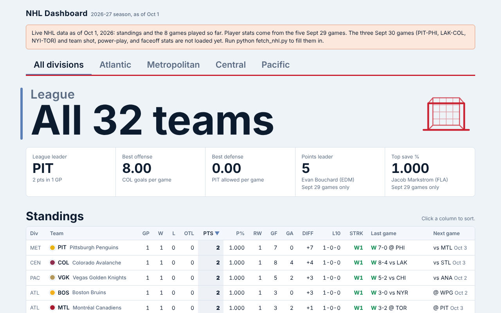
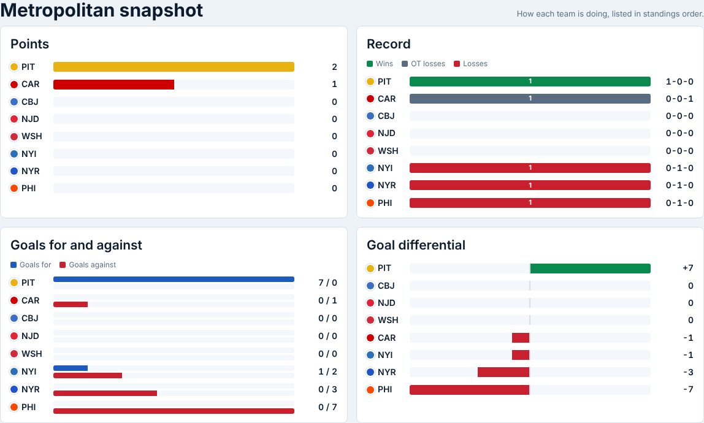
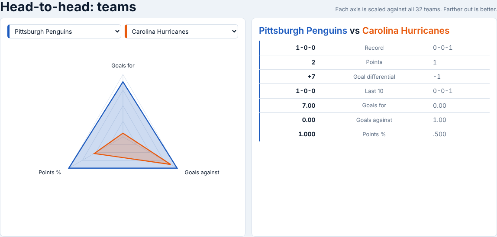

# NHL Division Dashboard

A single-page analytics dashboard for the current NHL regular season, organized by division. Standings, division insights, team and player leaders, and head-to-head radars, all in one static HTML file with the season data embedded. There is no backend, no build step, and no API key.

**Live:** https://maximhoeft94.github.io/nhl-division-dashboard/



## What it does

- **Division tabs** (All divisions, Atlantic, Metropolitan, Central, Pacific) that filter every section
- **Standings** sortable by any column, using the league's own tiebreakers, with a dashed line after the top 3 automatic playoff spots, plus each team's last and next game
- **Division insights** with ten views: form and home/road splits, goals for vs. against, playoff race and wild cards, points race, scoring leaders, division vs. division, special teams, shot share and PDO, schedule ahead, and expected goals
- **Team leaders** for goals, shots, power play, penalty kill, faceoffs, and goal differential
- **Skater and goalie leaders** filtered by position and stat
- **Head-to-head radars** for team vs. team and player vs. player (forwards, defensemen, goalies)

| Division snapshot | Head-to-head |
|---|---|
|  |  |

## How it works

```
NHL public API --(fetch_nhl.py)--> JSON embedded in index.html --> vanilla JS + inline SVG
```

- `index.html` is the whole dashboard: HTML, CSS, JavaScript, and the season data. Every chart is hand-built inline SVG.
- `fetch_nhl.py` pulls the current regular season and rewrites the data block between the `/*DATA_START*/` and `/*DATA_END*/` markers in `index.html`.
- With `--xg`, the script also fits a small expected-goals model (logistic regression on shot distance, angle, and type, written with only the standard library) on every shot on goal this season.
- `AUDIT.md` documents how the embedded data and every rendered value were checked against the league's feed.

## Stack

- HTML, CSS, and vanilla JavaScript, with no frameworks or chart libraries
- Python 3.9+ standard library only, for the data pull
- GitHub Actions for the daily data refresh, and GitHub Pages for hosting

## Run it

View it: open `index.html` in a browser, or visit the live link.

Refresh the data:

The repo refreshes itself. A GitHub Actions workflow (`.github/workflows/refresh-data.yml`) runs `fetch_nhl.py --xg` every morning, commits the new `index.html` if anything changed, and rebuilds the site. To refresh right away, open the **Actions** tab, pick **Refresh NHL data**, and click **Run workflow**.

To run it yourself:

```
python fetch_nhl.py
python fetch_nhl.py --xg    # also builds expected goals (first run is slower; shots are cached)
```

The script covers the current regular season only. It skips preseason and playoff games, and stops without writing anything if the API still reports a previous season. To update a different file, use `python fetch_nhl.py --html docs/index.html`.

## Data

NHL data comes from the league's public, undocumented web API (`api-web.nhle.com` and `api.nhle.com`), which can change without notice. This project is not affiliated with or endorsed by the NHL.

Built by Maxim Hoeft.
